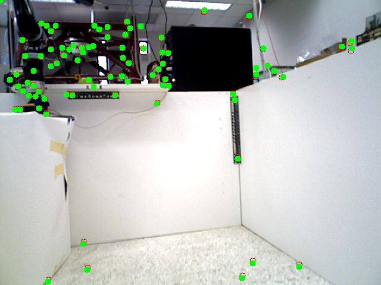
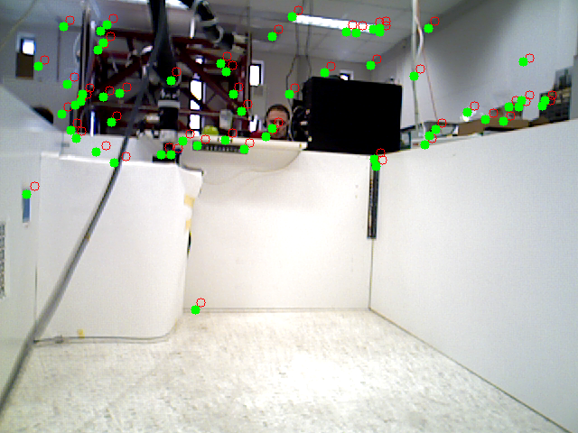
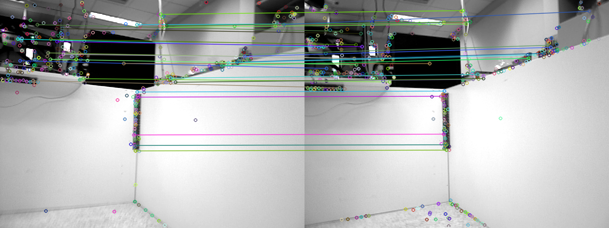

## Getting Started
These instructions will get you a copy of the project up and running on your local machine for development and testing purposes.

## Prerequisites
* Ubuntu 16.04 and later
* ROS kinetic and later
* Eigen 3.2.0 and later

## Installing
* git clone https://github.com/mrsp/klt_ros.git
* catkin_make

## Launch 
* Specify topics on config/bench_params.yaml
* roslaunch klt_ros klt_ros.launch

## Error Data Logging 
* Specify output_path in config/bench_params.yaml
* At output_path create four folders: keypoint_error, keypoint3D_error, matches, keypoints
* roslaunch klt_ros klt_ros.launch

## Documentation
* doxygen Doxyfile

## Example of transforming features detected in image 0 (red) to image 1 and comparison with detected features in image 1 (green)

  
   

## Example of transforming matching features detected in image 0  to image 1 

  

